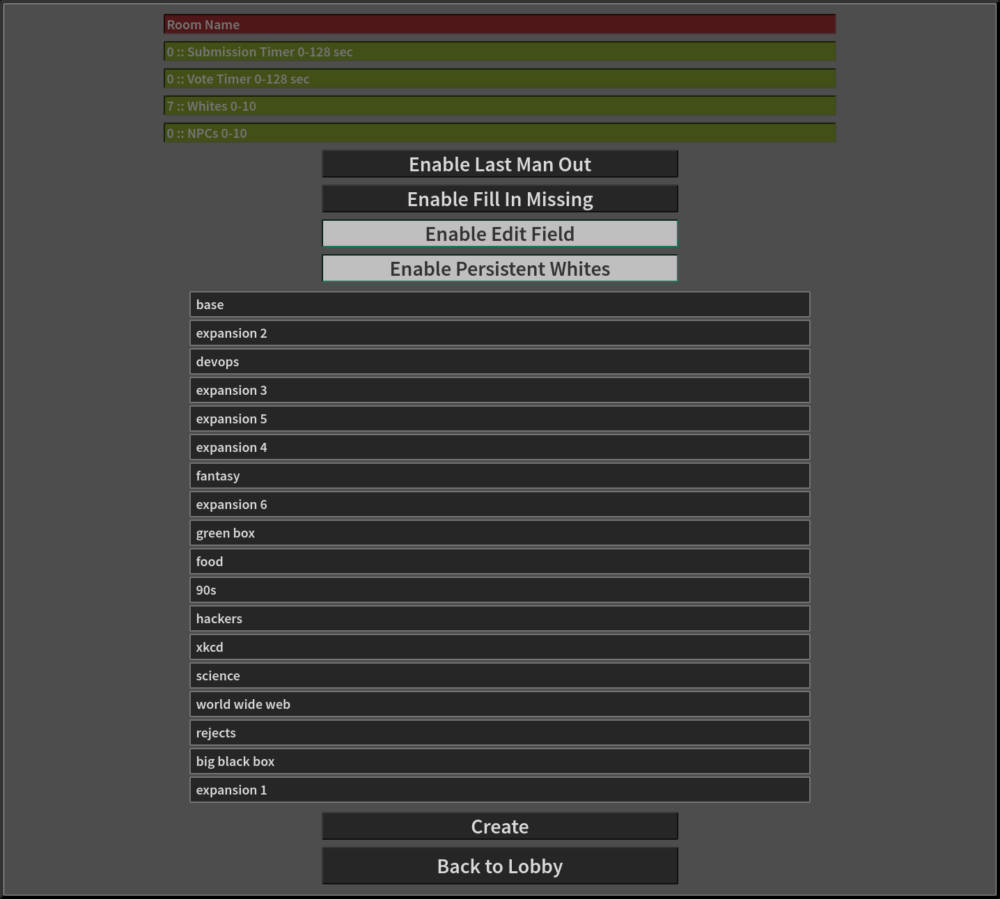
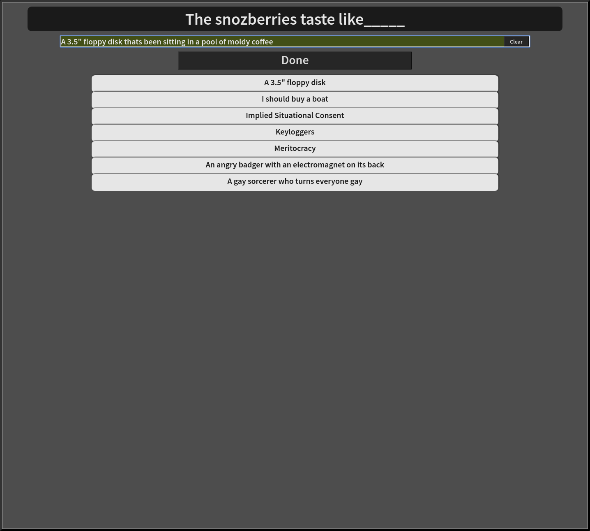

# Humanity

This is just a platform that allows for playing a version of the wonderful/terrible/hilarious/hideous game provided by these [fine folks](https://cardsagainsthumanity.com/).

## Prerequisites

1. Linux or UNIX
2. node.js [Check out NVM](https://github.com/creationix/nvm)


## Setup

1. npm i --only=dev
2. gulp setup


## Run

```./out/start``` can also be run with optional port: ```./out/start 1337```

### Problems

```sudo: node: command not found``` to fix this (if you used NVM) run: ```sudo ln -s "$NVM_DIR/versions/node/$(nvm version)/bin/node" "/usr/local/bin/node"```


## Screenshots

More in ```./screenshots```





## More card packs

The decision to use only single pick cards was purposeful. I have found things to simply run smoother with single pick cards. So the card pack importer scripts provided here will automatically strip any non single pick blacks out.

[JSON cards](https://www.crhallberg.com/cah/)

1. copy raw json string data from the above link
2. paste into file, eg: temp.json
3. run: ```node conv_cah.js temp "output pack name"```

### Cardcast pack support

1. search for packs: ```node cardcast.js search "search term"```
1. install a pack: ```node cardcast.js get "pack code" "output pack name"```

### Even more content

Make your own, put it in: ```./src/cards/```!

Template:

```
{
	"blacks": [
		"card text _____"
	],
	"whites": [
		"card text"
	]
}
```