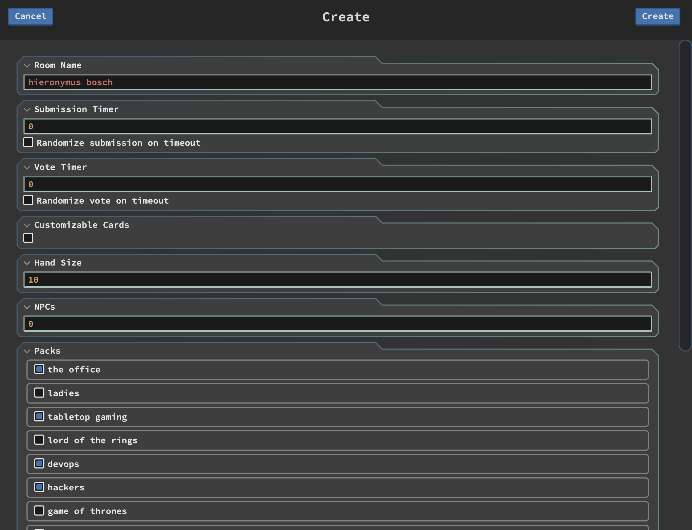
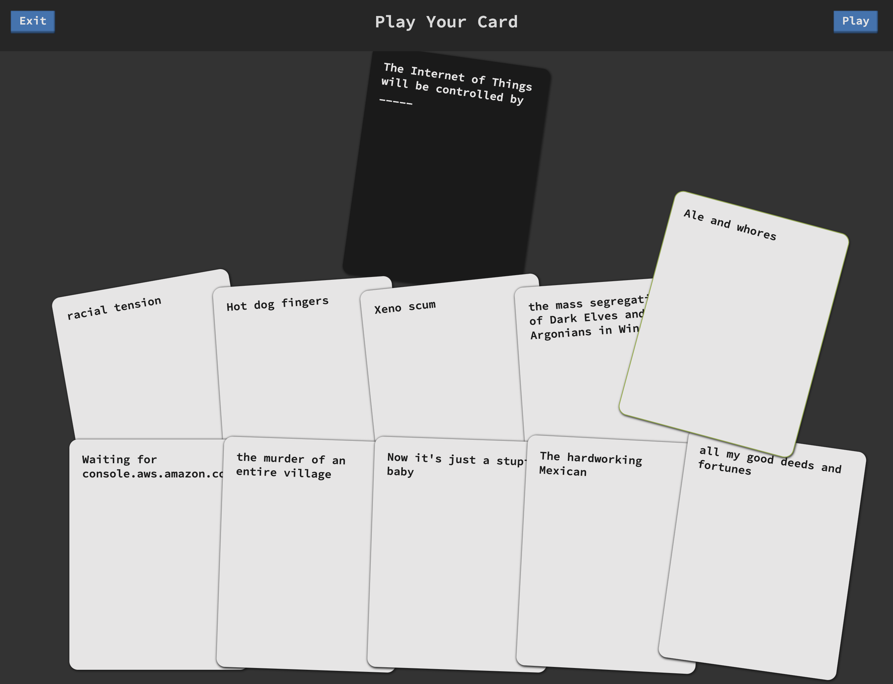
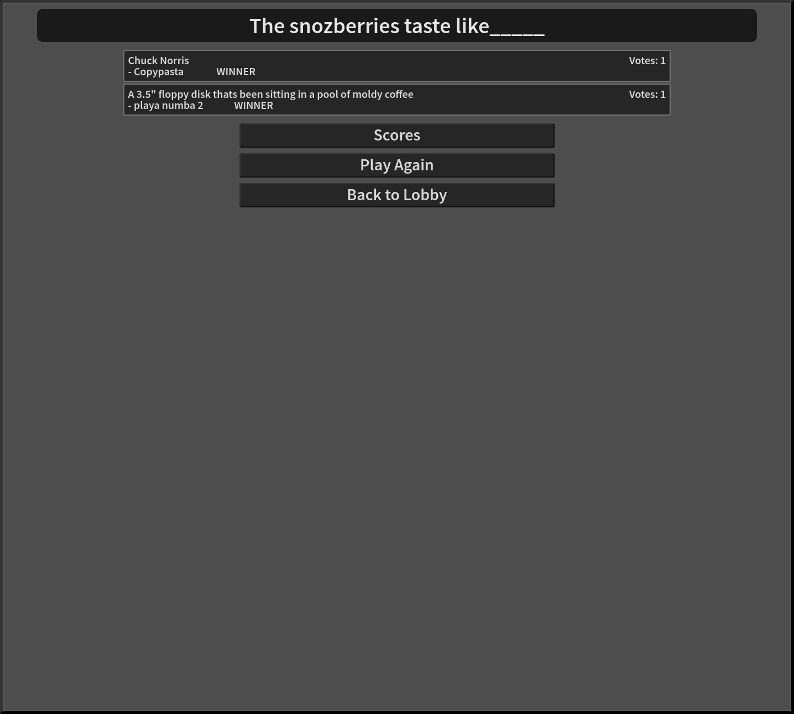

# Humanity

My digital take on the; wonderful, terrible, hilarious, hideous game provided by [these fine folks](https://cardsagainsthumanity.com/), and inspired by [jackbox](https://www.jackboxgames.com/).

## Prerequisites

1. Linux || UNIX || MacOS || [Linux subsystem for Windows](https://docs.microsoft.com/en-us/windows/wsl/install-win10)
2. [Node.js](https://nodejs.org/) (version >= V6.10.1 :: Check out [NVM](https://github.com/creationix/nvm))

## Setup

humanity/ $`npm i`

## Start

humanity/ $`npm start`

## Screenshots

More in [img](https://github.com/fatlard1993/humanity/tree/master/img)







## Card packs

The decision to use only single entry cards was purposeful. I have found that things simply run smoother with single entry cards, even in the physical game.

### Even more content

Make your own, put it in etc/cards.

Template:

```
{
	"blacks": [
		"card text _____"
	],
	"whites": [
		"card text"
	]
}
```
