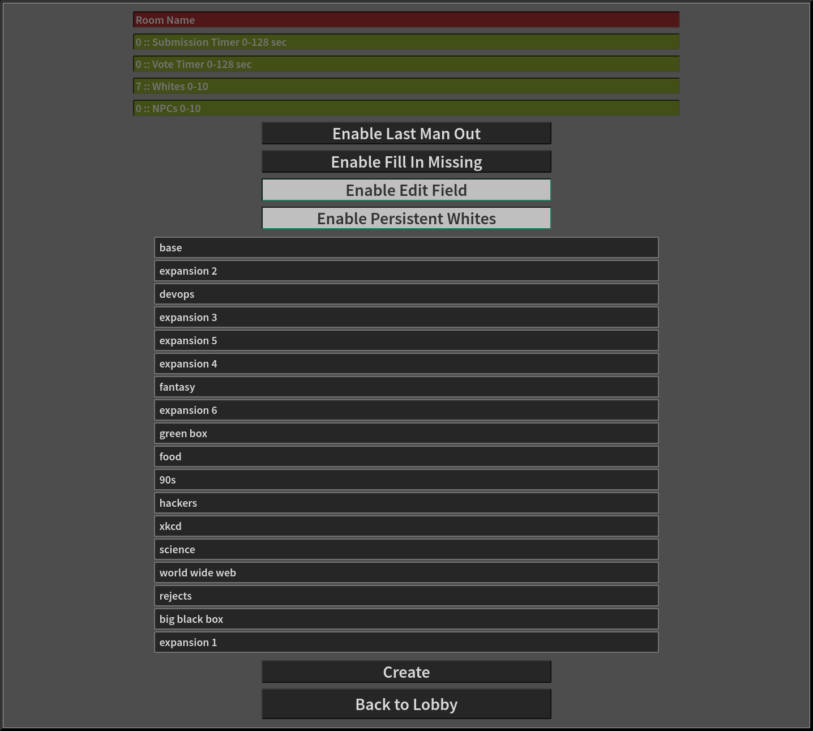
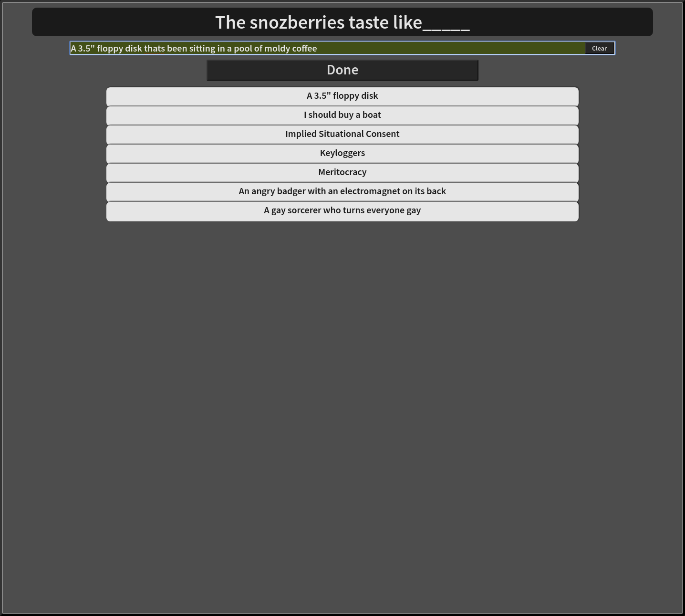
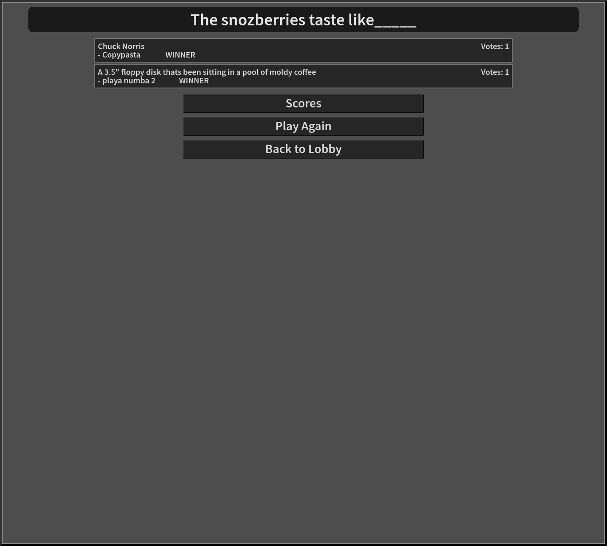

# Humanity

This is just a platform that allows for playing my take on the wonderful/terrible/hilarious/hideous game provided by these [fine folks](https://cardsagainsthumanity.com/).

## Prerequisites

1. Linux or UNIX
2. node.js [Check out NVM](https://github.com/creationix/nvm)


## Setup

/humanity$ ```./SETUP```


## Update the project and dependencies

/humanity$ ```./UPDATE```


## Run

/humanity$ ```./server/start```

OR

/humanity$ ```./server/start <port>```

OR

/humanity$ ```./server/start dbg <port>```

OR

/humanity$ ```./server/start dbg lvl <debug_level> <port>```


## Create dist folder

The dist folder contains a copy of all of the required files, which can be extracted from the rest of the project and ran elsewhere.

/humanity$ ```gulp dist```


## Run from dist

All aforementioned options are available, simply prepended with "dist" eg:

/dist$ ```./start dist <other_options>```


## Compile changes

This will also refresh any connected client pages.

/humanity$ ```gulp dev```

### Problems

```sudo: node: command not found``` to fix this (if you used NVM) run: ```sudo ln -s "$NVM_DIR/versions/node/$(nvm version)/bin/node" "/usr/local/bin/node"```


## Screenshots

More in ```./etc/screenshots```






## More card packs

The decision to use only single pick cards was purposeful. I have found things to simply run smoother with single pick cards, even in the physical game. So the card pack importer scripts provided here will try to automatically strip any non single pick blacks out.

[JSON cards](https://www.crhallberg.com/cah/)

1. copy raw json string data from the above link
2. paste into file, eg: temp.json
3. run: ```node ./scripts/conv_cah.js temp "output pack name"```

### Cardcast pack support

1. search for packs: ```node ./scripts/cardcast.js search "search term"```
2. install a pack: ```node ./scripts/cardcast.js get "pack code" "output pack name"```

### Even more content

Make your own, put it in: ```./server/cards/```!

Template:

```
{
	"blacks": [
		"card text _____"
	],
	"whites": [
		"card text"
	]
}
```