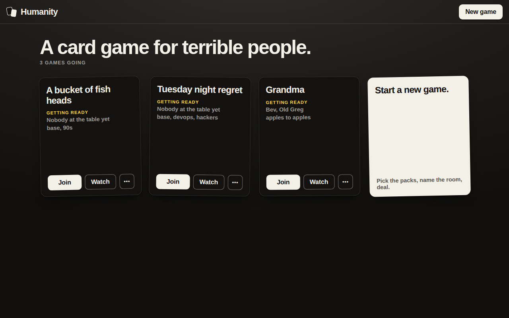
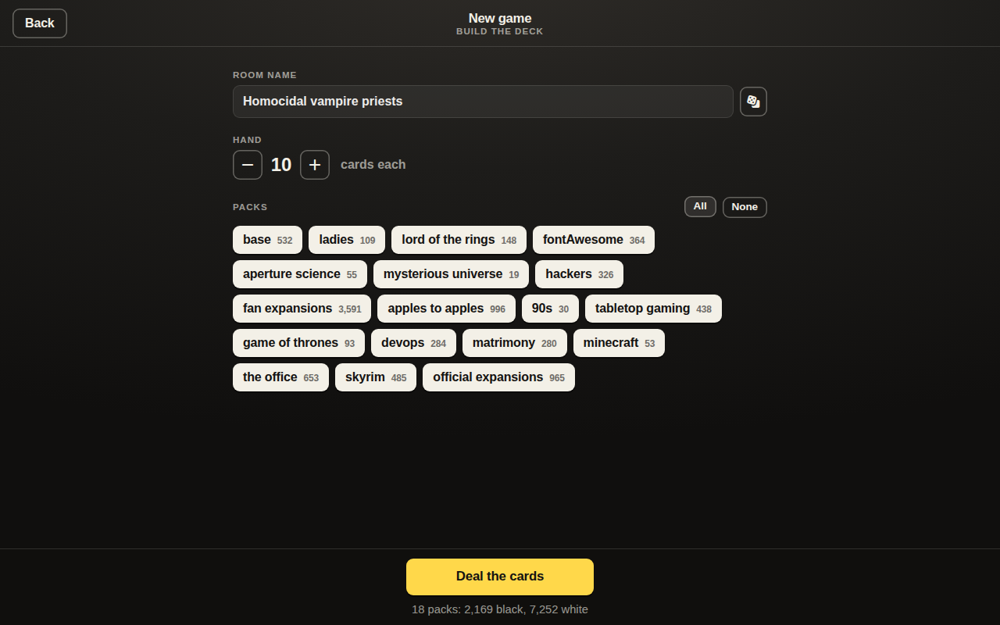
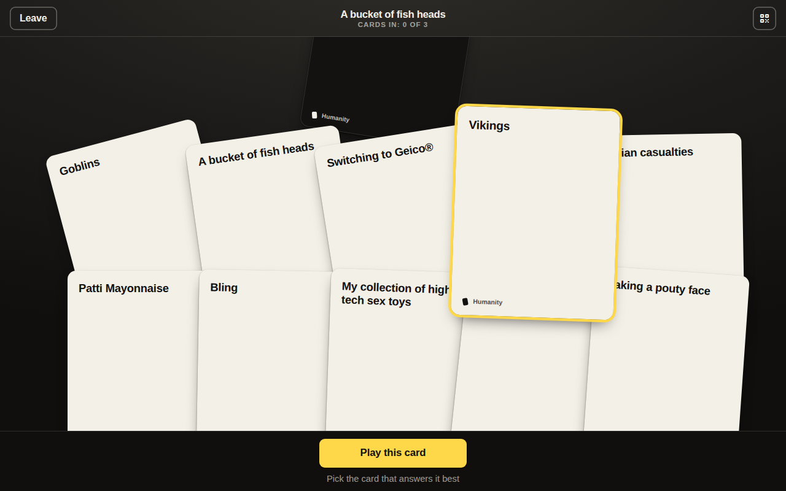
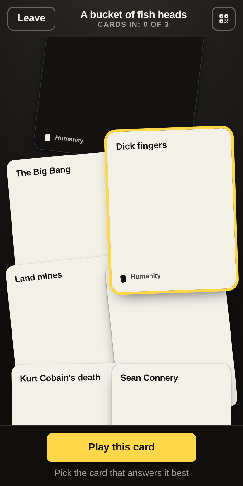
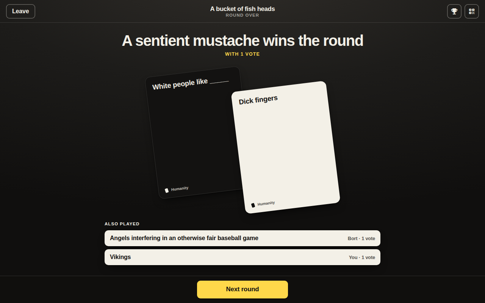
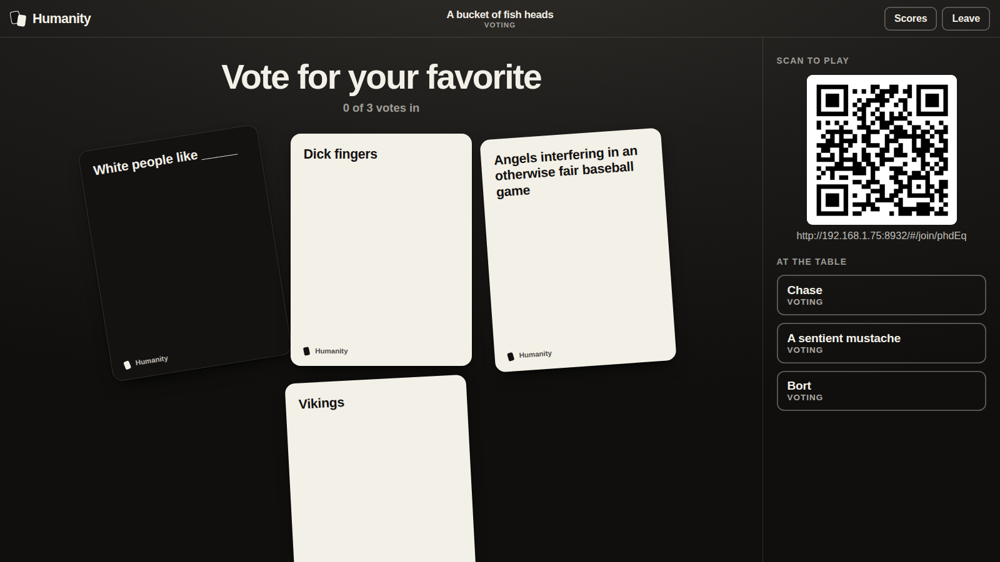

# Humanity

My digital take on the; wonderful, terrible, hilarious, hideous game provided by [these fine folks](https://cardsagainsthumanity.com/), and inspired by [jackbox](https://www.jackboxgames.com/).

[Built with Bun](https://bun.sh/)

## Screenshots













## Start

`bun install`, then `bun start` and open [http://localhost:8032](http://localhost:8032). Options: `--port`/`-p`, `--database`/`-d` (default `~/.humanity.json`) and `--verbosity`/`-v`.

`bun dev` restarts the server on save and rebuilds the client on change.

## Card packs

The decision to use only single entry cards was purposeful. I have found that things simply run smoother with single entry cards, even in the physical game.

### Even more content

Make your own pack, just put it in the cards folder.

Template:

```
{
	"blacks": [
		"card text _____"
	],
	"whites": [
		"card text"
	]
}
```
