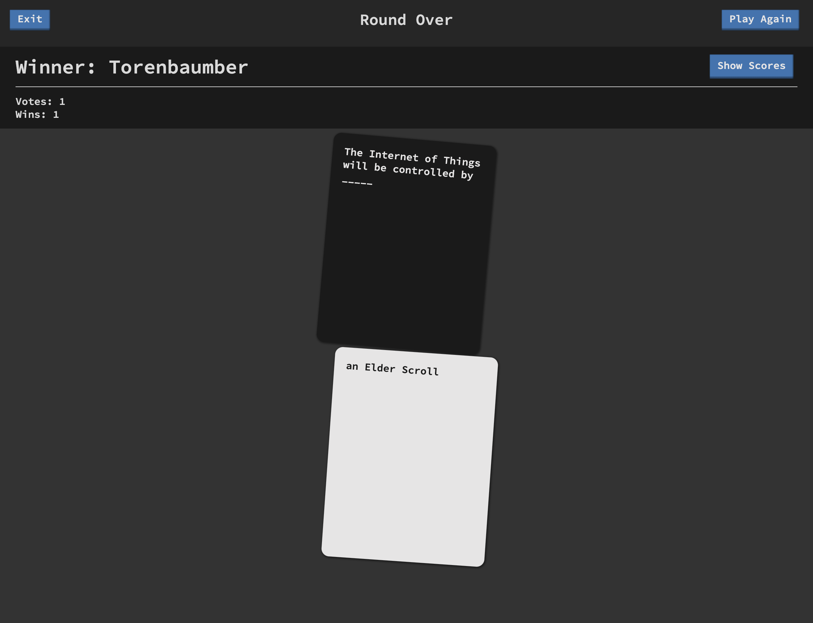

# Humanity

My digital take on the; wonderful, terrible, hilarious, hideous game provided by [these fine folks](https://cardsagainsthumanity.com/), and inspired by [jackbox](https://www.jackboxgames.com/).

## Prerequisites

1. Linux || UNIX || MacOS || [Linux subsystem for Windows](https://docs.microsoft.com/en-us/windows/wsl/install-win10)
2. [Node.js](https://nodejs.org/) (version >= V14 :: Check out [NVM](https://github.com/creationix/nvm))

## Setup

humanity/ $`npm i`

## Start

humanity/ $`npm start`

## Screenshots

More in [img](https://github.com/fatlard1993/humanity/tree/master/img)




## Card packs

The decision to use only single entry cards was purposeful. I have found that things simply run smoother with single entry cards, even in the physical game.

### Even more content

Make your own, put it in etc/cards.

Template:

```
{
	"blacks": [
		"card text _____"
	],
	"whites": [
		"card text"
	]
}
```

# TODO

- submit button doesnt enable without edit field
- veto kind of works..

  - it seems to lag an update ot maybe a timing issue on when the update is sent?

- submission length should be a game option
- edit field should be a text area
- trash whites doesnt work
- Should have a playerHTML content div
- modified card isnt used up
- block multiple connections from the same device?
- player images flicker during a ui refresh, figure out a better way to cache them so they aren't requested every time
- consider a game option for the vote type: (classic: 1, mob: everyone) last winner, next rotation, random


# Current WIP